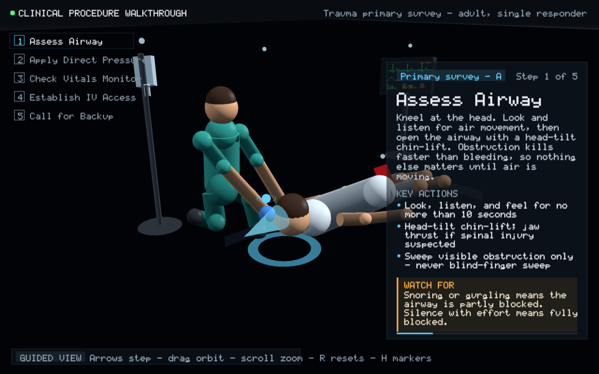
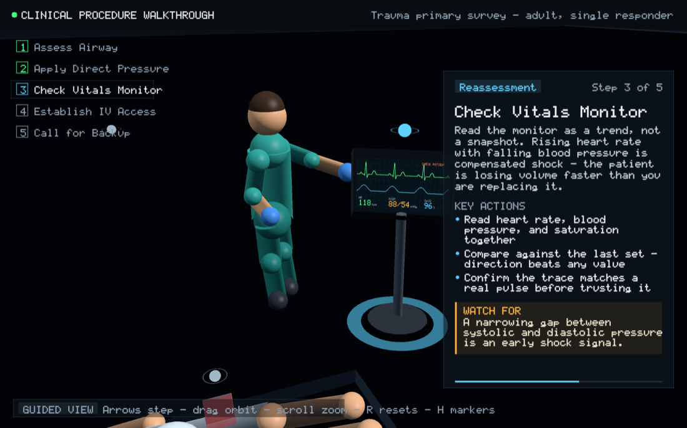
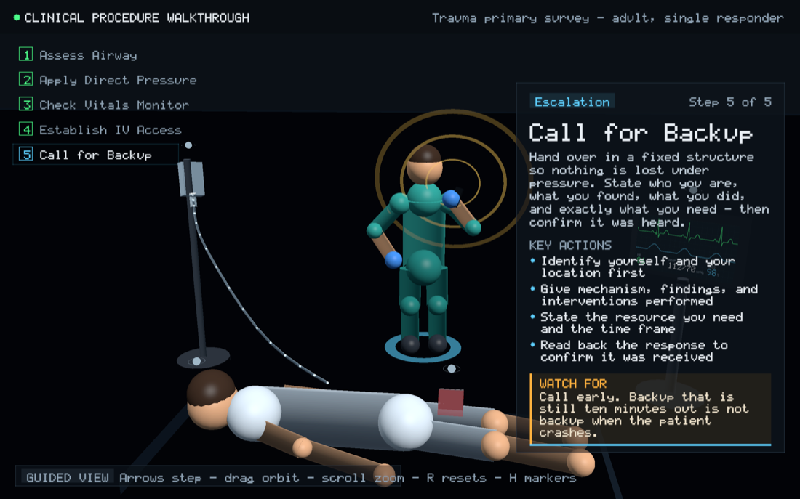
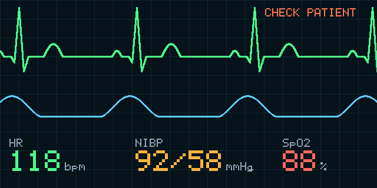

# 3D Clinical Procedure Walkthrough

An interactive, animated walkthrough of a trauma primary survey, rendered natively
in **Vulkan** (via MoltenVK on macOS). An animated responder carries out each step
on a patient while a teaching panel explains what is happening and why.

Five steps, advanced at your own pace:

1. **Assess Airway** — head-tilt chin-lift, look/listen/feel
2. **Apply Direct Pressure** — control the bleed
3. **Check Vitals Monitor** — read the trend, not the snapshot
4. **Establish IV Access** — large-bore cannula, start fluids
5. **Call for Backup** — structured handover



| Reading the monitor | Escalating for backup |
|---|---|
|  |  |

Everything on screen is generated in code. There are no model files, no textures
on disk, and no font files — the characters are built from procedural primitives
posed with inverse kinematics, and all text is drawn with an embedded bitmap font.

> **Educational prototype.** The content illustrates the *shape* of a primary
> survey for teaching purposes. It is not clinical guidance and must not be used
> to inform real patient care.

---

## Controls

| Input | Action |
|---|---|
| Right arrow / Space | Next step |
| Left arrow | Previous step |
| Left-drag | Orbit the camera |
| Right-drag | Pan |
| Scroll | Zoom |
| Click a marker | Jump to that step |
| `R` | Return to the guided camera |
| `H` | Show/hide the step markers |
| `Esc` | Quit |

Moving the camera drops you into free look; the panel shows which mode you are in.
Pressing `R` or changing step eases back to the framed shot for that step.

---

## Requirements

macOS with Homebrew. Vulkan reaches the GPU through MoltenVK, so no vendor driver
is needed.

```bash
brew install cmake glfw glm molten-vk vulkan-headers vulkan-loader shaderc
```

`shaderc` provides `glslc`, which CMake uses to compile the shaders to SPIR-V as
part of the build. The official LunarG SDK also works if you prefer it, but it is
not required.

## Build and run

```bash
cmake -S . -B build
cmake --build build
./build/ClinicalWalkthrough
```

If CMake cannot find GLFW or GLM, point it at your Homebrew prefix. On an Intel
prefix (`/usr/local`) with x86_64 dependencies, the architecture must match:

```bash
cmake -S . -B build -DCMAKE_PREFIX_PATH=/usr/local -DCMAKE_OSX_ARCHITECTURES=x86_64
```

On an Apple Silicon prefix, use `-DCMAKE_PREFIX_PATH=/opt/homebrew` and omit the
architecture flag. Check which you have with `brew --prefix`.

---

## How it works

**Geometry** (`src/mesh.cpp`) — Six unit primitives (cylinder, sphere, box, quad,
ring, cone) are generated with normals into one vertex and one index buffer. Every
object in the scene is one of those primitives with a transform, so a frame is a
few hundred indexed draws with no buffer rebinding.

**The rig** (`src/scene.cpp`) — Limbs are cylinders stretched between joint
positions, with a closed-form two-bone IK solver placing elbows and knees from a
hand or foot target. Each step declares hand targets, a kneel amount, and a
camera; every animated value is exponentially eased toward it, so transitions are
frame-rate independent.

**Text and the monitor** (`src/canvas.cpp`, `src/font.cpp`, `src/ui.cpp`) — Vulkan
has no text rendering, so text is rasterized on the CPU into an RGBA image using
an embedded 5x7 bitmap font, along with lines and circles. Two of those images are
uploaded as textures: the vitals monitor screen, repainted every frame with a live
ECG, plethysmograph, and readouts, and the teaching panel, repainted when the step
changes.



**Rendering** (`src/main.cpp`) — Four pipelines share the render pass: a lit pass
for solid geometry, an unlit alpha-blended pass for markers and highlights, a
textured pass for the monitor screen, and a screen-space pass that composites the
teaching panel. Colors are authored as sRGB and lit in linear space, with the sRGB
swapchain re-encoding on write.

**Picking** — Clicking unprojects the cursor through the inverse view-projection
matrix and tests the ray against a sphere at each step marker.

---

## Verifying changes without a screen

Two environment variables make the app dump what it would draw, which is useful in
CI or over SSH, and is how the visuals in this README were checked:

```bash
# Write the panel, monitor, and a font sheet as PNGs, without opening a window
CLINICAL_DUMP=dump ./build/ClinicalWalkthrough

# Render each step and read the frames back from the swapchain into PNGs
CLINICAL_CAPTURE=dump ./build/ClinicalWalkthrough
```

The PNG encoder is hand-rolled (`Canvas::writePng`) so this pulls in no image
libraries.

---

## Project layout

```
├── CMakeLists.txt
├── src/
│   ├── main.cpp      Vulkan setup, pipelines, texture uploads, input
│   ├── scene.cpp     rig, posing, props, per-frame draw list
│   ├── steps.cpp     the five scenarios: content, camera, staging
│   ├── mesh.cpp      procedural primitives
│   ├── canvas.cpp    CPU RGBA drawing and PNG output
│   ├── font.cpp      embedded 5x7 bitmap font
│   └── ui.cpp        monitor screen and teaching panel painters
├── shaders/          lit, flat, textured, and overlay stages
├── docs/             screenshots used in this README
└── web/              browser version (React Three Fiber)
```

## Web version

`web/` holds an earlier browser implementation of the same walkthrough built with
React Three Fiber, including optional WebXR support for headsets:

```bash
cd web
npm install
npm run dev
```

The native app is the primary implementation; the two share the same scenario
content and staging.
